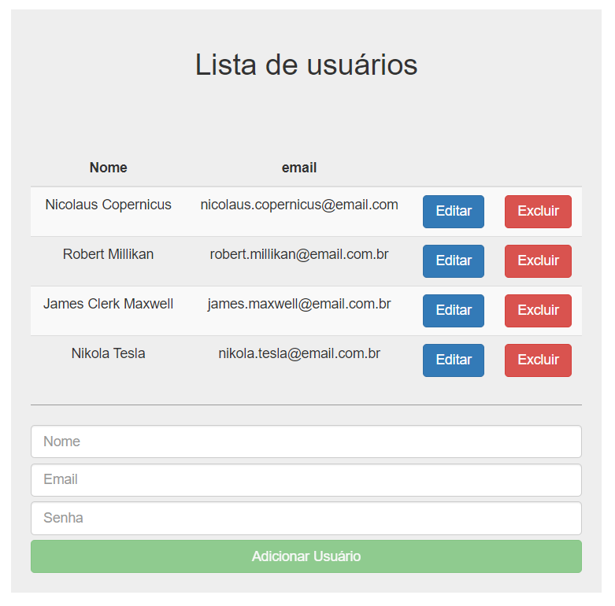

# First-Desafio-Java-Angular
Você está trabalhando em um projeto de uma aplicação web usando Java (Spring) no back-end e angular no front-end. Sua tarefa é criar a funcionalidade de cadastro de usuários

Segue o scrpit.sql para a tebela de usuários.

Abaixo está a tela para a listagem e p formuláro para usuários.

Tela para cadastro, listagem, alteração e exclusão de usuário.

