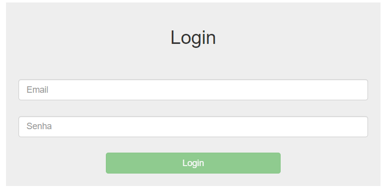

# First-Desafio-Java-Angular
Você está trabalhando em um projeto de uma aplicação web usando Java (Spring) no back-end e angular no front-end. Sua tarefa é criar a funcionalidade de cadastro de usuários

Segue o [script.sql](script.sql) para a criação e a inserção do primeiro usuário com a senha encriptografada. 
Senha 123456. 
Cada usuário tem a sua politica de de ações. 
Caso queira colocar outro usuário e colocar outra senha pode usar essa main Java para colocar outra senha.
[GerarSenha.java](usuario%2Fsrc%2Fmain%2Fjava%2Fbr%2Fcom%2Fcadastrousuario%2Fusuario%2FGerarSenha.java)

"ADMIN" para excluir, alterar, adicionar e visualizar. 
"USER" somente visualizar. 
Todas as requisições são validas com uma chave JWT. 
Todas as senhas estão encriptografadas.

Abaixo está a tela de login.

Após efetuar o login, será apresentado a seguinte tela para se trabalhar com a lista de usuários.

Tela para cadastro, listagem, alteração e exclusão de usuário.

